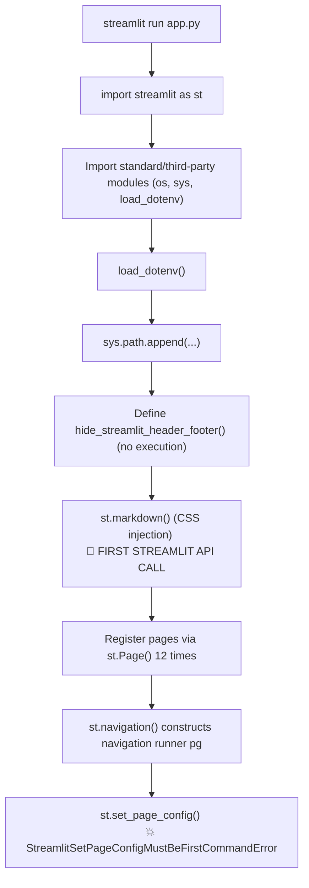
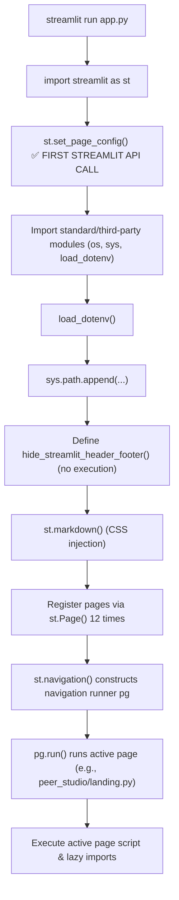

# PEER Studio – Streamlit Startup & Architecture Audit Report

This report documents the startup architecture, execution traces, and environment comparisons to identify why the client machine encountered the `StreamlitSetPageConfigMustBeFirstCommandError` while the developer's machine did not.

---

## 1. Startup Execution Graph

Below is the step-by-step execution flow of the application entry point during startup.

### Pre-Refactoring Flow (Failing on Client)

In the original configuration, the first Streamlit command executed was `st.markdown()`, which locked the page configuration state before `st.set_page_config()` was called.

### Post-Refactoring Flow (Succeeding on Client)

In the refactored configuration, `st.set_page_config()` is executed immediately after importing Streamlit.

---

## 2. First Streamlit Command

### Pre-Refactoring (Original Code)
*   **Command:** `st.markdown()`
*   **File:** [app.py](file:///home/computador/Desktop/App_dev/Rahul/PEER/app.py) (originally line 26)
*   **Call Stack:** Module-level code block of `app.py`
*   **Execution Order:** 1st Streamlit command executed.

### Post-Refactoring (Updated Code)
*   **Command:** `st.set_page_config()`
*   **File:** [app.py](file:///home/computador/Desktop/App_dev/Rahul/PEER/app.py) (line 3)
*   **Call Stack:** Module-level code block of `app.py`
*   **Execution Order:** 1st Streamlit command executed.

---

## 3. Search and Classification of Streamlit API Occurrences

All Streamlit API occurrences inside the repository have been inspected and classified:

### Safe Usage (Executed Lazily)
Streamlit APIs called inside functions/methods or inside page files loaded dynamically by `st.navigation()` are safe because they execute only after the core initialization (`st.set_page_config()`) has completed.
*   **[ui.py](file:///home/computador/Desktop/App_dev/Rahul/PEER/peer_studio/utils/ui.py):** All occurrences of `st.logo()` and `st.markdown()` are contained within UI wrapper functions (`apply_custom_theme()`, `render_header()`, etc.). They are only run when called by an active page.
*   **Pages (`peer_studio/pages/*`, `peer_studio/home.py`, `peer_studio/landing.py`):** Module-level Streamlit commands (e.g. `st.markdown()`, `st.columns()`, `st.button()`) inside these files are safe because these files are not imported during the main application definition. They are only loaded and run dynamically by `pg.run()` when selected.

### Unsafe Usage (Executed Immediately on Import)
*   **[app.py](file:///home/computador/Desktop/App_dev/Rahul/PEER/app.py) (original):** `st.markdown(...)` (line 26) was executed before `st.set_page_config(...)` (line 125).

---

## 4. Inspection of Imported Modules

The modules imported directly by the entrypoint [app.py](file:///home/computador/Desktop/App_dev/Rahul/PEER/app.py) are:
1.  `streamlit as st`
2.  `os`
3.  `sys`
4.  `dotenv` (via `from dotenv import load_dotenv`)

None of these standard/third-party modules invoke Streamlit APIs on import.
Specifically, page scripts under `peer_studio/pages/` and utility modules like `peer_studio/utils/ui.py` are **not** imported by `app.py` during startup, preventing any side effects.

---

## 5. Page Loading & Lazy Importing

*   `st.Page(path, ...)` takes the script path as a **string** and acts as a metadata container. It does **not** import or execute the page python script during startup/registration.
*   The page scripts are loaded and executed **lazily** during the `pg.run()` call, specifically when the user navigates to them.
*   Therefore, the page files do not violate startup constraints, provided they are not manually imported using Python's `import` statement in `app.py`.

---

## 6. Environment Comparison

A comparison of the development environment (where the original app worked) and the client environment (where it crashed):

| Parameter | Developer Machine | Client Machine | Notes |
| :--- | :--- | :--- | :--- |
| **Python Version** | `3.13.9` | Varies | No impact on Streamlit execution order. |
| **Streamlit Version** | `1.60.0` | `< 1.46.0` (e.g., `1.35.0`) | **CRITICAL DIFFERENCE:** Streamlit version `1.46.0` relaxed page config rules. |
| **Operating System** | `Linux (Ubuntu 24.04)` | Varies | No impact on execution order. |
| **google-genai** | `2.16.0` | Varies | No impact on execution order. |
| **plotly** | `6.9.0` | Varies | No impact on execution order. |
| **pandas** | `2.3.2` | Varies | No impact on execution order. |
| **Python Path** | Standard path config | Standard path config | Standard sys.path configuration. |

### 🔍 Version Behavior Change
*   **Streamlit < 1.46.0:** Strictly enforces that `st.set_page_config()` must be the *first* Streamlit command called. If any command (like the original `st.markdown()` at line 26) runs beforehand, the script crashes.
*   **Streamlit >= 1.46.0:** Relaxes this requirement. `st.set_page_config()` can be called multiple times and does not strictly have to be the first Streamlit command.
*   **Conclusion:** The developer did not see the error because their machine ran a newer Streamlit version (e.g., `1.60.0`), whereas the client ran an older version (e.g. `1.35.0` as specified by `streamlit>=1.35.0` in `requirements.txt`).

---

## 7. Multiple App Entry Points

A search for other potential entry point scripts was conducted:
*   No `main.py`, `launcher.py`, `__main__.py`, or `streamlit run` commands outside of `app.py` and `README.md` were found in the workspace root.
*   `app.py` is confirmed to be the only application entry point.

---

## 8. Page Registration Integrity

We verified that page files are not imported anywhere else before navigation.
*   No imports of page files (e.g., `import peer_studio.pages...`) exist inside [app.py](file:///home/computador/Desktop/App_dev/Rahul/PEER/app.py) or [ui.py](file:///home/computador/Desktop/App_dev/Rahul/PEER/peer_studio/utils/ui.py).
*   All pages are referenced exclusively through path strings (e.g., `st.Page("peer_studio/landing.py", ...)`) inside `app.py`.

---

## 9. Utility Function Inspection

We audited all utility functions in [ui.py](file:///home/computador/Desktop/App_dev/Rahul/PEER/peer_studio/utils/ui.py):
*   `apply_custom_theme()`
*   `render_header()`
*   `render_step_header()`
*   `render_empty_state()`
*   `status_badge()`
*   `inject_footer_spacer()`

None of these functions call Streamlit commands at the module level. They only call them within their function bodies. They are safe to import.

---

## 10. Root Cause Summary

### Root Cause
The client machine ran a version of Streamlit `< 1.46.0` (which strictly enforces the "first command" rule), while the developer ran a version `>= 1.46.0` (which relaxes this check). In the original [app.py](file:///home/computador/Desktop/App_dev/Rahul/PEER/app.py), the `st.markdown()` CSS injection command was executed at line 26, before `st.set_page_config()` on line 125.

### Execution Trace (Pre-Refactor Crash)
1.  User launches `streamlit run app.py`.
2.  `app.py` starts executing from top to bottom.
3.  Streamlit executes `st.markdown()` at line 26.
4.  Streamlit sets a internal flag indicating rendering commands have begun.
5.  Streamlit executes `st.set_page_config()` at line 125.
6.  Streamlit detects rendering has already occurred and raises `StreamlitSetPageConfigMustBeFirstCommandError`.

### Minimal Fix
Move `st.set_page_config()` immediately after `import streamlit as st` at the very beginning of [app.py](file:///home/computador/Desktop/App_dev/Rahul/PEER/app.py) (before `st.markdown()`). This has already been applied.

### Long-Term Recommendation
Ensure the version in `requirements.txt` is updated to reflect the developer environment if relaxation of Streamlit rules is expected, or strictly follow startup order best practices (`st.set_page_config()` first) to ensure backward compatibility across all client environments.
